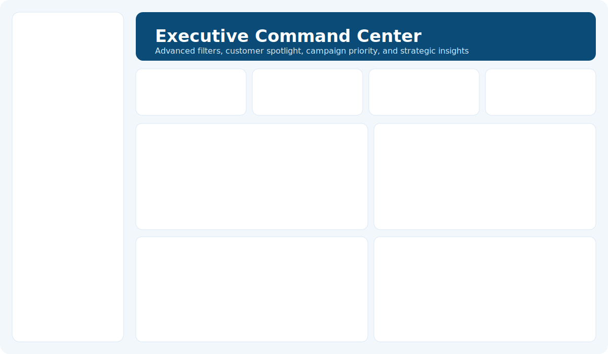
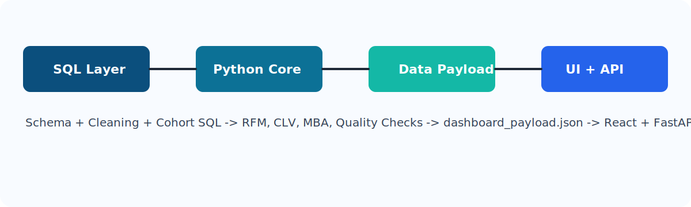

<div align="center">
  

  <h1>Consumer360</h1>
  <p><b>Production-Ready Retail Intelligence Platform</b></p>
  <p><i>Customer Segmentation • CLV Intelligence • Retention Analytics • Campaign Actioning</i></p>

  <p>
    
    
    
    
    
  </p>

  <p>
    <a href="#product-preview">Preview</a> •
    <a href="#architecture-snapshot">Architecture</a> •
    <a href="#quick-start">Quick Start</a> •
    <a href="#api-endpoints">API</a>
  </p>
</div>

---

## Product Preview
<p align="center">
  
</p>

## Architecture Snapshot
<p align="center">
  
</p>

## Why Consumer360
<table>
  <tr>
    <td><b>Champion Discovery</b><br/>Automatically identifies high-value customers for premium engagement.</td>
    <td><b>Churn Risk Prevention</b><br/>Builds action lists to prioritize retention interventions weekly.</td>
  </tr>
  <tr>
    <td><b>Advanced Analytics Stack</b><br/>RFM + CLV + Cohort + Market Basket in a single product workflow.</td>
    <td><b>Business-Ready Delivery</b><br/>Dashboard + API + exports + automation scripts included.</td>
  </tr>
</table>

## Core Capabilities
- **RFM Segmentation Engine**: 1-5 scoring with segment labels (Champions, At Risk, Hibernating, etc.)
- **Predictive CLV**: BG/NBD + Gamma-Gamma modeling via `lifetimes`
- **Cohort Retention Matrix**: Month-wise retention trends for behavioral analysis
- **Market Basket Rules**: Cross-sell associations using support/confidence/lift
- **Data Quality Guardrails**: Validates transaction quality before publishing outputs
- **Executive Dashboard (React)**: Sidebar controls, spotlight search, insights, and campaign priority table
- **FastAPI Service Layer**: Programmatic access to payload, KPIs, campaigns, quality checks

## Quick Start
### 1) Install
```powershell
pip install -r requirements.txt
```

### 2) Run Pipeline
```powershell
python -m src.main --run-date 2026-02-27
```

### 3) Launch Dashboard
```powershell
./run_frontend.ps1
```
Open: `http://localhost:5173`

### 4) Launch API
```powershell
./run_api.ps1
```
Open docs: `http://127.0.0.1:8000/docs`

### 5) One-Command Full Flow
```powershell
./run_consumer360.ps1 -RunDate 2026-02-27 -LaunchFrontend -LaunchApi
```

## API Endpoints
- `GET /health`
- `GET /payload`
- `GET /kpis`
- `GET /campaigns`
- `GET /quality`

## Output Artifacts
- `reports/data_quality_report.json`
- `reports/customer_rfm_segments.csv`
- `reports/customer_clv.csv`
- `reports/cohort_retention.csv`
- `reports/market_basket_rules.csv`
- `reports/campaign_champions.csv`
- `reports/campaign_churn_risk.csv`
- `frontend/public/data/dashboard_payload.json`

## Repository Structure
```text
api/                FastAPI service
config/             Runtime and brand settings
docs/               Docs + visual assets
frontend/           React + Vite dashboard
reports/            Generated outputs
sql/                Schema and SQL scripts
src/                Analytics pipeline modules
```

## Roadmap
- Role-based auth and access control
- PDF executive report export
- Scenario simulator for campaign budget planning
- Docker + CI/CD deployment pipeline

## License
MIT
